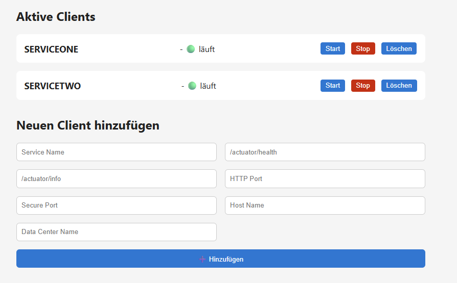

# Eureka service registering all services in services.json
Goal of this project is a simple and small client to provide a migration path for everyone stuck with Spring Eureka.
The microservices that are your own responsibility should be freed from the burden of running a Eureka client that is no longer in use but is still needed for your customers. 
In a Cloud Native world, the microservices are hidden behind one or more load balancers. Therefore, we need a client that handles the registration of the microservices and uses the load balancer addresses as the destination url.

## new java version
If you are looking for a spring boot application doing this stuff use: https://github.com/wlanboy/eurekaclientjava

## run
```
uv sync
uv run client.py
```

### from scratch
- cd mirrorapi
- uv sync
- uv pip compile pyproject.toml -o requirements.txt
- uv pip install -r requirements.txt
- uv run client.py

## simple client
- client.py running the registras
- eureka_client_lib.py request client for the eureka api

## client with metriks
- client_with_metrics.py running the registras and webserver for metrics endpoints
- eureka_client_lib.py request client for the eureka api
- metrics_exporter.py prometheus client publishing metrics about the registras

## run eureka server
- see: https://github.com/wlanboy/ServiceRegistry

## run simple client
```
export EUREKA_SERVER_URL="http://gmk:8761/eureka/apps/"
python3 client.py
or
uv run client.py
```

## run client with metrics
```
export EUREKA_SERVER_URL="http://gmk:8761/eureka/apps/" \
export METRICS_SERVER_HOST="192.168.1.100" \
export METRICS_SERVER_PORT="8080" \
python client.py
or
uv run client_with_metrics.py
```

## run web ui
```
.venv/bin/uvicorn webserver:app --reload
```
